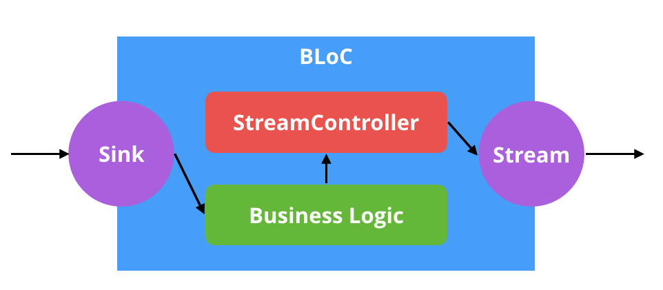

# **PROJECT peruvian_identifier**

App para consultar personas y empresas peruanas por DNI y RUC

## FLUTTER Y PATRON BLoC

El proyecto utiliza Flutter como ejemplo simple del patron BLoC, sin
librerías.  
El patrón BLoc es un estilo arquitectónico para estructurar los
proyectos en
Flutter, de tal forma que la vista y el la Lógica de negocio estén
separados.

1. **Sink**: Entradas(Datos o Eventos)
2. **Streams**: Salidas(Cambios que se hace al estado)
3. **BLoC:** Una clase que contiene a los Stream Controller y a la Lógica de negocio

## Ventanas de la App
  

